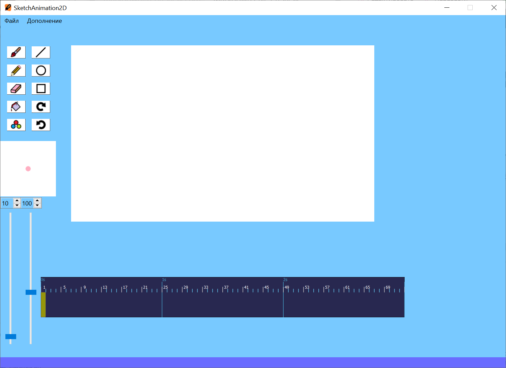
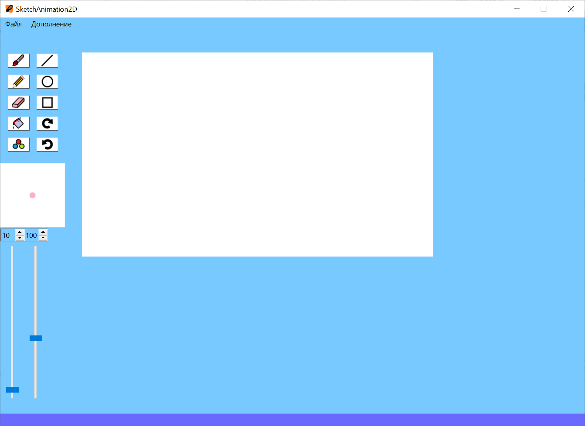

### [УСТАНОВКА и ЗАПУСК](#raz1) и [ВОЗМОЖНОСТИ ПРОГРАММЫ](#raz2)

Программа по созданию растровой 2D анимации




<a name="raz1"></a>
# УСТАНОВКА и ЗАПУСК
Используется `Visual Studio Code`\
Актуален для `Python 3.12.x` (установлен расширением VScode)\
Библиотеки `pip install {библиотека}`:
- `PyQt6`
- `pyqt-tools`
- `opencv-python`

Или безопаснее поставить версии актуальные для этой программы\
в проекте/папке с репозиторием VScode написать `pip install -r requirements.txt`

И стандартные библеотеки Python:
- `os`
- `math`
- `sys`

После установки библиотек заходим в `sketchanimation2d.py` в VScode\
и запуска через `f5` или другим любым способом

Для удобной работы с файломи `.ui`, можно установить `Qt Designer`

### Не отображается TimeLine | Таймлайн

### __Решение:__
В модуле PyQt6 (путь Python)\
`...\Python\Python{ваша версия}\Lib\site-packages\PyQt6\uic\Compiler\`\
или путь по пользователю\
`C:\Users\{пользователь}\AppData\Local\Programs\Python\Python{ваша версия}\Lib\site-packages\PyQt6\uic\Compiler\`


Открываем файл `qtproxies.py` в текстовом редакторе например VScode\
Находим (строка/line - __321__):
```python
class QWidget(QtCore.QObject):
```

после этого класса (строка/line - __332__)\
добавляем класс:
```python
class TimeLine(QWidget): pass
```

<iframe
  src="https://carbon.now.sh/embed?bg=rgba%2874%2C144%2C226%2C0%29&t=vscode&wt=boxy&l=python&width=680&ds=false&dsyoff=20px&dsblur=68px&wc=false&wa=true&pv=56px&ph=56px&ln=true&fl=320&fm=Fira+Code&fs=14px&lh=152%25&si=false&es=2x&wm=false&code=...%250Aclass%2520QWidget%28QtCore.QObject%29%253A%250A%2520%2520def%2520font%28self%29%253A%250A%2520%2520%2520%2520return%2520Literal%28%2522%2525s.font%28%29%2522%2520%2525%2520self%29%250A%250A%2520%2520def%2520minimumSizeHint%28self%29%253A%250A%2520%2520%2520%2520%2520return%2520Literal%28%2522%2525s.minimumSizeHint%28%29%2522%2520%2525%2520self%29%250A%250A%2520%2520def%2520sizePolicy%28self%29%253A%250A%2520%2520%2520%2520%2520sp%2520%253D%2520LiteralProxyClass%28%29%250A%2520%2520%2520%2520%2520sp._uic_name%2520%253D%2520%2522%2525s.sizePolicy%28%29%2522%2520%2525%2520self%250A%2520%2520%2520%2520%2520return%2520sp%250A%2523%2520%25D0%2594%25D0%25BE%25D0%25B1%25D0%25B0%25D0%25B2%25D0%25BB%25D1%258F%25D0%25B5%25D0%25BC%2520%25D1%2581%25D1%258E%25D0%25B4%25D0%25B0%2520-%2520class%2520TimeLine%28QWidget%29%253A%2520pass%250Aclass%2520QDialog%28QWidget%29%253A%2520pass%250Aclass%2520QColorDialog%28QDialog%29%253A%2520pass%250A..."
  style="width: 616px; height: 497px; border:0; transform: scale(1); overflow:hidden;"
  sandbox="allow-scripts allow-same-origin">
</iframe>

Сохраняем изменения и компилируем заново `sketchanimation2d.py`\
после этого можно удалять в `qtproxies.py` класс с:\
`class TimeLine(QWidget): pass`

<a name="raz2"></a>
# ВОЗМОЖНОСТИ ПРОГРАММЫ
1. [Инструменты для рисования](#spe1)
1. [ТаймЛайн](#spe2)
1. [Раздел - Файл](#spe3)
1. [Прочее](#spe4)


<a name="spe1"></a>
## 1. Инструменты для рисования

### Кисти:

Шершавая кисть `Ctrl+B`\
Карандаш/ручка `Ctrl+P`\
Ластик `Ctrl+U`

* __Параметры (ползунки) кисти:__\
__Толщина__ (слева крайний ползунок):\
Клавиши (в англ расскладке):\
 `[` - уменьшает\
 `]` - увеличивает\
__Прозрачность__

### Прочее:
Заливка `Ctrl+F`
* Параметр (ползунок) заливки\
_сила закрашивание цветов_

Палитра цветов `Ctrl+G`

### Фигуры:
Линия `Ctrl+L`\
Эллипс(Овал) `Ctrl+A`\
Прямоугольник `Ctrl+K`

### Действия:
Вперёд `Ctrl+Y`\
Назад `Ctrl+Z`

__Рисование/закрашивание__ - `ЛКМ` по холсту\
__Пипетка__ - `ПКМ` по холсту

Чтобы работала функция изменения\
толщины при нажима стилуса:\
> Дополнение >> Толщина при стилусе меняется +

После подключения планшета
- автоматически рисует по нажиму стилуса
- при переключение на мышь - толщина не поменяется

<a name="spe2"></a>

## 2. ТаймЛайн

### Добавление фрейма и выбор - ПКМ:
Нажатие на область где фреймы
- создаст фрейм длительностью 1 кадр\
Если нажатие на фрейм - то выберится этот фрейм\
_холст поменятся на картинку фрейма_

### Изменение Длительность фрейма:

1) Нажатие `ползунка мыши` + `A` (в англ расскладке)
   - на область до куда будет длительность фрейма

2) Через клавиши\
`9` - уменьшает до длительности в 1 кадр\
`0` - увеличивает
(если доходит до других фреймов, то отодвигает их)

1) `Ctrl + ПКМ`
   - Заполнение всех промежутков между фреймами

### Удаление фреймов:
Клавиша `Delete` на выборанном фрейме
- переместит к 1 фрему
- и 1 фрейм нельзя удалить

### Перемещение по таймлайну:
По фрейму через клавиши:\
`1` - в левого соседа фрейма\
`2` - в правого соседа фрейма

### Прокрутка по таймлану:
1) Через прокрутку `колёсика мыши`:\
`вверх` - вправо (бесконечно)\
`вниз` - влево (до 1 кадра)

2) Через `Ctrl` + `Зажатое колёсико мыши`
и передвижение мыши _быстрее 1_:\
`вправо мышь` - вправо (бесконечно)\
`влево мышь` - влево (до 1 кадра)

### Проигрование таймлайна:
`R` (в англ расскладке)
- запускает/останавливает проигрование кадров
- можно проигрывать с любого кадра
- проигрывает 10 раз (если не останавливать)
- остановить проигрование можно, 
выбрав любой фрейм
- после остановки (нажатие `R`)\
выбранный фрейм будет тот,
на котором остановился

<a name="spe3"></a>

## 3. Раздел - Файл

> ПРИ КАЖДОМ СОХРАНЕНИИ
ВСЁ СОДЕРЖИМОЕ ПАПКИ УДАЛЯЕТСЯ
ДЛЯ СОЗДАНИЯ НОВЫХ ФРЕЙМОВ

### Сохранить Папку Ctrl+S
### Сохранить Папку как... Ctrl+Shift+S
в новую папку
### Экспорт в Картинку
сохраняет холст с текущем фреймом
### Экспорт в Видео
сохраняет в форматы mp4, mov, avi
### Открыть Папку Ctrl+O
загружает папку с фреймами
### Открыть Картинку
открывает картинку в текущий холст\
можно и через перетаскивания файла в программу
_работает `Drag&Drop`_
### Создать новый холст Ctrl+N
(создаёт холст с заданным размером)


<a name="spe4"></a>

## 4. Прочее
### При закрытии программы может предложить сохранить
если вы не сохранили до этого изменения на холсте